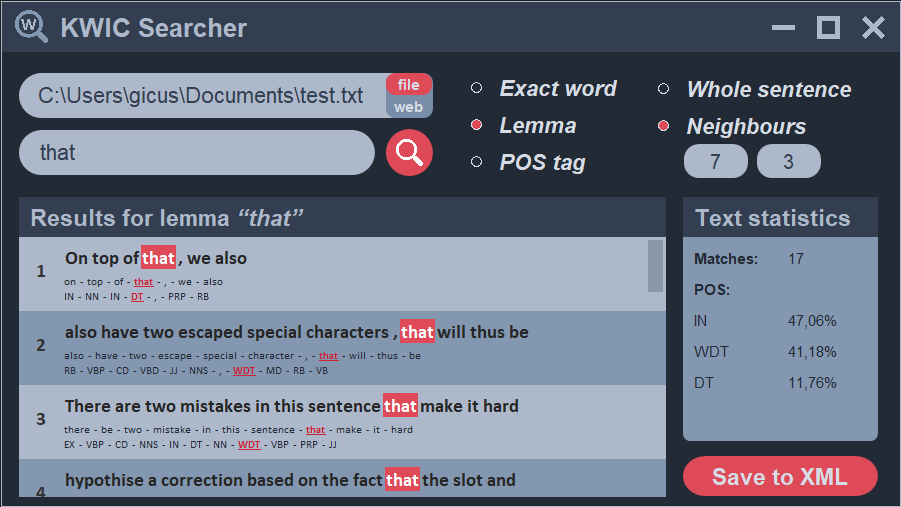

# KWIC Searcher

This Java software offers a graphical user interface to search and visualise _**k**ey **w**ords **i**n **c**ontext_ based on their
word form, lemma or [POS tag](https://www.ling.upenn.edu/courses/Fall_2003/ling001/penn_treebank_pos.html):

### Resources:

- **Swing** environment (GUI).
- **Apache OpenNLP** library (models: _en-sent.bin_, _en-token.bin_, _en-pos-maxent.bin_, _en-lemmatizer.bin_).
- **JSoup** library (web scraping).

### Note

The source code of this project is not yet publicly available because parts of this program are a graded task for
students enrolled in the Computational Linguistics program at the University of Tübingen.
